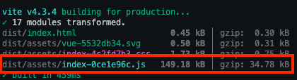

# library-not-tree-shakeable [#13087](https://github.com/vitejs/vite/issues/13087)

Library whose components use `defineComponent` not tree shakeable

## Repo setup

This repo contains 2 vite projects scaffolded by running `npm create vite@latest`. 

One is `vue-library`, which is a Vue 3 component library configured in "library mode", aligning with the Vite [documentation](https://vitejs.dev/guide/build.html#library-mode). For simplicity, I've built the library and `npm pack`ed it in the directory. `vue-lib-1.0.0.tgz` is the consumable tarball representing the package.

The other is `vue-app`, which is a vanilla Vue 3 application. I've installed the `vue-library` tarball directly, as you can see in `vue-app/package.json`.

The page component imports 1 of 2 available components from the `vue-library`:

```vue
<script setup>
// vue-app/src/App.vue
import HelloWorld from './components/HelloWorld.vue'
import { ComponentA } from 'vue-lib';
</script>

<template>
  <div>
    <a href="https://vitejs.dev" target="_blank">
      
    </a>
    <a href="https://vuejs.org/" target="_blank">
      
    </a>
  </div>
  <HelloWorld msg="Vite + Vue" />
  <ComponentA/>
</template>
```

## Steps to reproduce

```bash
git clone https://github.com/HeavyMedl/library-not-tree-shakeable.git
cd ~/library-not-tree-shakeable/vue-app
npm ci
npm run build
```

Inspect the bundle produced by Vite in `dist/assets`.



## What is expected?

The bundle should only contain `vue-library/src/components/ComponentA.vue` code, with `vue-library/src/components/ComponentB.vue` code tree shaken out

## What is happening?

`vue-library/src/components/ComponentB.vue` code is built into the bundle.

```javascript
// vue-app/dist/assets/index-0ce1e96c.js
...
const ComponentA = /* @__PURE__ */ _export_sfc(_sfc_main$1, [["render", _sfc_render$1], ["__scopeId", "data-v-ea310018"]]);
defineComponent({
  name: "ComponentB",
  props: {
    msg: {
      type: String,
      default: "Component B"
    }
  },
  setup() {
    const count = ref(0);
    return {
      count
    };
  }
});
...
```

## System info

```
  System:
    OS: macOS 13.3.1
    CPU: (10) arm64 Apple M1 Max
    Memory: 60.81 MB / 32.00 GB
    Shell: 5.9 - /bin/zsh
  Binaries:
    Node: 16.13.0 - ~/.nvm/versions/node/v16.13.0/bin/node
    npm: 8.1.0 - ~/.nvm/versions/node/v16.13.0/bin/npm
  Browsers:
    Chrome: 113.0.5672.63
    Firefox: 111.0.1
    Safari: 16.4
  npmPackages:
    @vitejs/plugin-vue: ^4.1.0 => 4.2.1 
    vite: ^4.3.2 => 4.3.4 
```

## Any additional comments?

There doesn't seem to be any problem with tree shaking when using the `<script setup/>` syntactic sugar or Options API to define a component. The problem seems isolated to using `defineComponent`. You can work around this by prefixing `/*@__PURE__*/` to `defineComponent`, i.e.

```javascript
export default /*@__PURE__*/ defineComponent(/* ... */)
```

However, according to the [docs](https://vuejs.org/api/general.html#definecomponent), this shouldn't be required when using Vite.

> Note this is not necessary if you are using Vite, because Rollup (the underlying production bundler used by Vite) is smart enough to determine that defineComponent() is in fact side-effect-free without the need for manual annotations.
